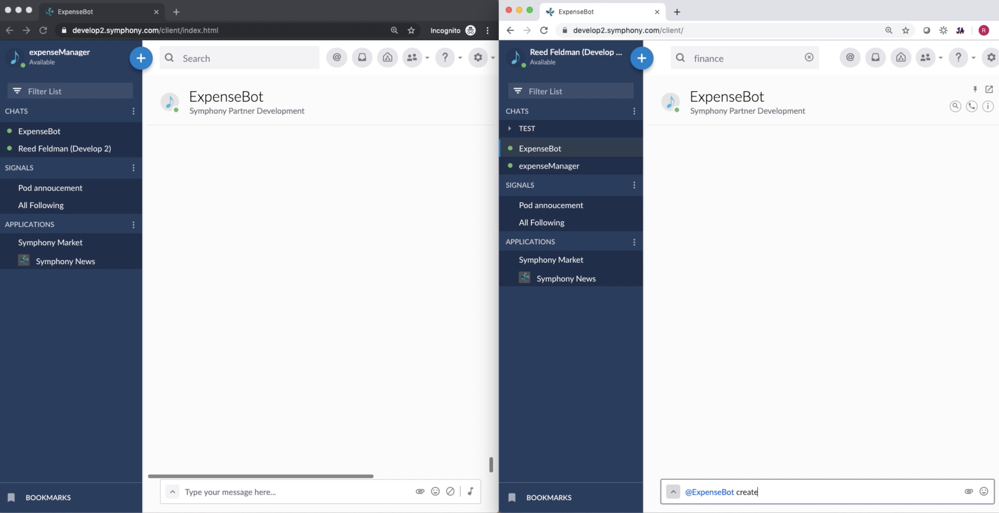

# symphony-expense-bot-python
Demo expense report bot showcases how to use Symphony Elements and Amazon Textract


Watch the demo video below:

[](https://drive.google.com/file/d/1MvCYIAWjkwk5-0TbBIm6K4KCQPownU-V/view?usp=sharing)


# Configuration

## Populate Configuration Files

resources/config.json

* Set your SessionAuth URL, KeyAuth URL, Pod URL, and Agent URL respectively:

```
{
    "sessionAuthHost": "develop2.symphony.com",
    "sessionAuthPort": 443,
    "keyAuthHost": "develop2.symphony.com",
    "keyAuthPort": 443,
    "podHost": "develop2.symphony.com",
    "podPort": 443,
    "agentHost": "develop2.symphony.com",
    "agentPort": 443,
    ...
    
}
```
* Set Authentication Method and point configuration file to RSA Private Key or Certificate:

```
{
  ...
  "authType": "rsa",
  "botPrivateKeyPath": "./rsa/",
  "botPrivateKeyName": "rsa-private-karlPythonDemo.pem",
  ...
}
```

* Configure bot username and email address corresponding to the bots service account in the dedicated Pod
* Set optional truststore path

```
{
  ...
  "botUsername": "karlPythonDemo",
  "botEmailAddress": "karlPythonDemo@demo.com",
  "truststorePath": ""
}
```
resources/environment.json

* Configure Bot UserID, MongoDB Credentials, and AWS IAM User Info:

```
{
  "bot_id" : "BOT ID",
  "db" : "DB NAME",
  "host": "MONGODB URI",
  "region": "us-east-1",
  "aws_access_key_id": "YOUR AWS ACCESS KEY ID",
  "aws_secret_access_key": "YOUR AWS SECRET ACCESS KEY"
}
```

# Testing

* In order to test locally, follow configuration instructions above and clone repo
* Install dependencies locally:

```
$ python3 -m venv env
$ source env/bin/activate
$ pip install -r requirements.txt

```
Navigate to expenseBot/python and run:

```
$ python3 main_rsa.py
```

# MongoDB

Connect to MongoDB via pymongo or mongoengine:

* https://docs.mongodb.com/ecosystem/drivers/pymongo/

# AWS Textract

* Create AWS IAM User Account to access AWS Features
* Leverage AWS Textract using boto3 python SDK: https://boto3.amazonaws.com/v1/documentation/api/latest/reference/services/textract.html
* Check out the developers guide for using AWS Textract: https://docs.aws.amazon.com/textract/latest/dg/getting-started.html
